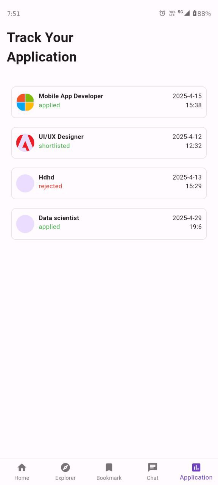

# 📱 HireHub – Flutter Job-Seeking App

**HireHub** is a modern, mobile-first job-seeking application built with Flutter and powered by [Supabase](https://supabase.com). It provides a streamlined experience for job seekers to explore job listings, track applications, manage profiles, chat with recruiters, and upload resumes — all from their phone.

---

## 🚀 Features

### 👤 Authentication
- Secure sign-up and sign-in
- Session management using Supabase

### 🏠 Home Page
- Displays a list of active job postings
- Integrated with Supabase backend

### 🔍 Explore Page
- Discover additional job listings with flexible filtering

### 📌 Bookmark Page
- Save and view bookmarked job posts

### 💬 Real-Time Chat
- Connect and chat with recruiters in real-time (via Supabase Realtime)


### 📝 Application Tracking
- Track the status of job applications

### 📄 Resume Management
- Upload different resumes for different job applications

### 👤 User Profile
- View and update personal details

---

## 🧑‍💼 Recruiter Panel

Recruiters can post and manage jobs via a dedicated web panel built separately from the mobile app.

- 🌐 **Live Recruiter Panel**:  
  [https://hire-hub-recruiter-panel.vercel.app/recuiter](https://hire-hub-recruiter-panel.vercel.app/recuiter)

- 💻 **Recruiter Panel GitHub Repository**:  
  [https://github.com/akashpd390/hire_hub_recruiter_panel](https://github.com/akashpd390/hire_hub_recruiter_panel)

---

## 📦 Tech Stack

- Flutter
- Supabase (Auth, Realtime, Storage, Database)
- `provider` (State management)
- `get_it` (Dependency injection)
- `flutter_dotenv` (Environment variable handling)
- `fluttertoast`, `file_picker`, `open_file`, `url_launcher`, and more

---

## 📲 Download

Download the latest **Release APK**:  
🔗 [Release APK on GitHub](https://github.com/akashpd390/HireHub/releases)

---

## 📷 Screenshots


  
  
  



---

## 📁 Project Structure

- `lib/` – Main application code
- `lib/data/` – Supabase data sources
- `lib/presentation/` – UI pages and providers
- `lib/core/` – Config and dependency injection

---

## 🛠️ Setup Instructions

```bash
git clone https://github.com/akashpd390/HireHub.git
cd HireHub
flutter pub get
```

Make sure your `.env` file is set up, then run the app:

```bash
flutter run
```
---

## ⚙️ .env Setup Guide

Create a `.env` file in the root of your Flutter project:

```env
SUPABASE_URL=https://your-project.supabase.co
SUPABASE_ANON_KEY=your-anon-key
```

Make sure to declare this in your `pubspec.yaml`:

```yaml
flutter:
  assets:
    - .env
```

---